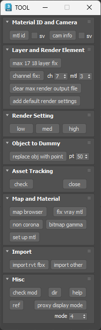
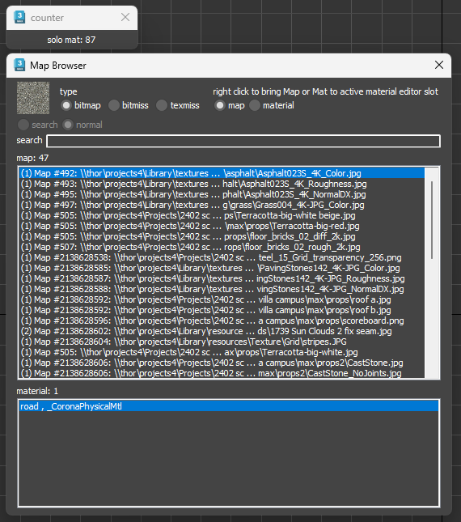
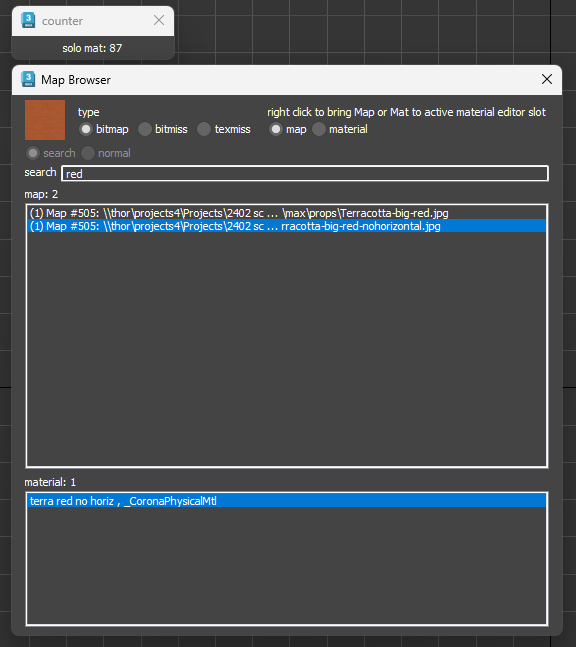
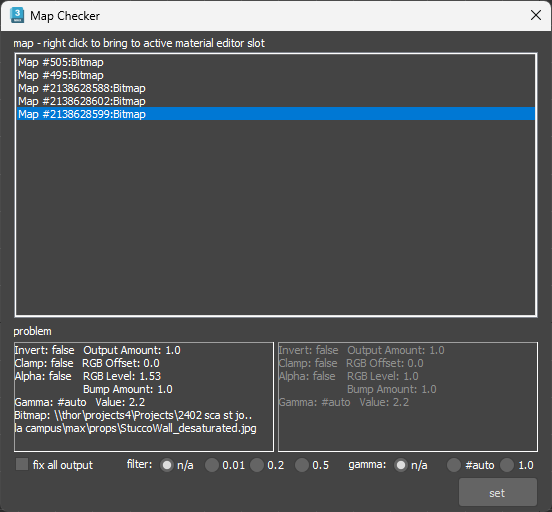
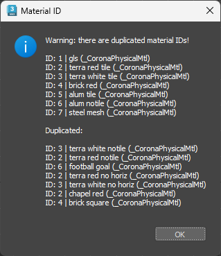

# QX Toolbox (New 2025) for 3ds Max 🎨

A comprehensive collection of scripts designed to streamline common workflows in 3ds Max, developed between 2023 and 2025. This toolbox automates tedious tasks, from scene cleanup and asset management to V-Ray render optimization, allowing artists to focus on creativity and production.

## 🚀 Key Features

### 🔧 Scene & Asset Management

* **Map Browser**: An advanced tool for checking and managing scene maps. Quickly identify **missing maps**, view map properties, and load them into the Material Editor. It features a robust search function and color-coded statuses to help you pinpoint issues instantly. 
* **Non-Corona Material Finder**: This one-click tool finds and selects all objects in your scene that are assigned non-Corona materials. This is crucial for optimizing rendering performance and troubleshooting unexpected shading.
* **Object to Dummy**: Replaces selected objects with point dummies, automatically placing the original objects into a hidden layer. This is an essential function for managing heavy scenes, improving viewport performance, and preparing assets for external workflows.
* **Layer & Channel Fix**:
    * **Layer Fix**: Corrects a common bug in 3ds Max 2017/2018 where objects can lose their layers. The tool re-assigns selected objects to a new layer, ensuring proper scene organization.
    * **Channel Fix**: Streamlines your render pass workflow by automatically removing existing **MultiMatteElements** and creating new ones based on your specified G-Buffer channel and material ID counts.

### 💡 Rendering & Optimization

* **Render Setting Presets**: Quickly switch between **Low**, **Medium**, and **High** render quality presets with a single click. These presets are designed to provide a fast workflow for test renders and final production.
* **Clear Render Output File**: A simple but effective tool to clear any set render output file path, preventing accidental overwrites.
* **Asset Tracking**: Provides quick access to the native 3ds Max Asset Tracking System, helping you to identify and manage file paths and missing assets.
* **Corona Proxy Display Mode**: This tool allows you to quickly change the display mode of all selected **Corona Proxies**. You can either toggle between four different modes (e.g., box, point, full mesh) or set a specific display mode directly, which significantly improves viewport performance on heavy scenes.

### ⚙️ Corona Renderer Tools

* **Material ID and Camera Info**: This dual-function tool provides critical information about your scene's setup.
    * **Material ID Check**: Scans your scene for all materials with an effects channel (Material ID) and flags any duplicated IDs, which can cause issues in post-production. This function now supports **Corona Materials**.
    * **Camera Info**: Provides a detailed report on all physical cameras in your scene, including lens focal length, exposure settings (f-number, shutter speed, ISO), and transform lock status. This function now supports **Corona Cameras**.
* **Default Render Elements**: Automatically adds a comprehensive list of essential Corona render elements to your scene, including **Direct, Emission, Indirect, Reflect, Refract, ZDepth, WireColor, Material ID, Object ID**, and a pre-configured **CoronaAO** pass.

### ⚒️ Material & Proxy Tools

* **Bitmap Gamma Fixer**: A specialized tool for **auditing and fixing bitmap textures**. It scans the scene for common issues like incorrect gamma settings, inverted outputs, or misplaced file paths. It provides a detailed report on each problem and allows you to apply bulk fixes to correct gamma and other output settings, ensuring proper texture rendering. This is crucial for ensuring textures like **normal maps** have a gamma of 1.0 while others have an `auto` gamma.
* **Reference Plane Creator**: A quick utility to create a reference plane with a specified size. It automatically assigns a **Standard Material** and a bitmap texture to the plane, configures the UVW map, and makes the plane semi-transparent for easy alignment. It can also bring the material into the active Material Editor slot.

### 🔎 Utilities & Maintenance

* **Import Workflow**: This section provides two specialized tools for cleaning up imported geometry. The **Revit FBX Importer** deletes all lights, cameras, and helpers, and then cleans the imported geometry by applying a random wire color, resetting XForm, centering pivots, and converting everything to an editable mesh. The **General Importer** performs the same cleanup without the additional XForm and mesh conversion steps, making it suitable for all imported geometry.
* **Modifier Check**: Scans your scene for objects with disabled modifiers and provides a report. It also automatically selects these objects so you can quickly address them.
* **Project Directory**: Opens the current 3ds Max project directory in a new explorer window, saving you from navigating through folders.
* **3ds Max Help**: A quick button that opens the official Autodesk 3ds Max Scripting Reference website, providing fast access to help and information.

## 📅 Release History

This toolbox has evolved through several iterations. The initial versions were built for **V-Ray** and included specific functions such as V-Ray material cleanup and a V-Ray proxy display toggle. Subsequent updates introduced new tools and adapted existing ones for **Corona Renderer**. The latest version of the script is now fully focused on the Corona workflow, while still maintaining some of the universal tools from the original V-Ray version.

## 🖼️ Screenshots

A visual guide to the toolbox's user interface and its various functions.

* **Main Floater**: A screenshot of the consolidated main toolbox floater, showing all categorized functions.

* **Map Browser**: A screenshot of the Map Browser UI, demonstrating how to check for missing maps and their properties.

* **Bitmap Gamma Checker**: A screenshot of the Gamma Checker UI, showing how to search for incorrect gamma setups and fix them.

* **Material ID Check**: A screenshot of the message box displaying the Material ID report, including duplicated IDs.

## 🛠️ Installation

1.  Download the repository as a ZIP file.
2.  Unzip the contents to a folder on your computer.
3.  Open 3ds Max.
4.  Drag and drop the `qx_toolbox.mcr` file into the 3ds Max viewport.
5.  A dialog will pop up, confirming the installation.
6.  To launch the script, go to **Customize** > **Customize User Interface**.
7.  In the "Toolbars" tab, under the "Category" dropdown, find **"QX_Toolbox"**.
8.  Drag the **"QX_Toolbox"** action onto a toolbar in your UI. You can also assign a keyboard shortcut or a quad menu item if you prefer.

## 💡 Notes

* **V-Ray and Corona Compatibility**: This toolbox is designed to be compatible with both **V-Ray** and **Corona**. While some tools are renderer-specific, the core scene and asset management functions are universal. All tools work perfectly across 3ds Max 2014 through 2025.
* **Undos**: All operations are undoable via the standard **Ctrl+Z** hotkey, so feel free to experiment without worry.
* **File Paths**: Some internal paths are hardcoded for `ms*` files. Ensure all files (`.ms .mse`) from the toolbox are in the same folder as the main `.mcr` file.

Happy rendering!
